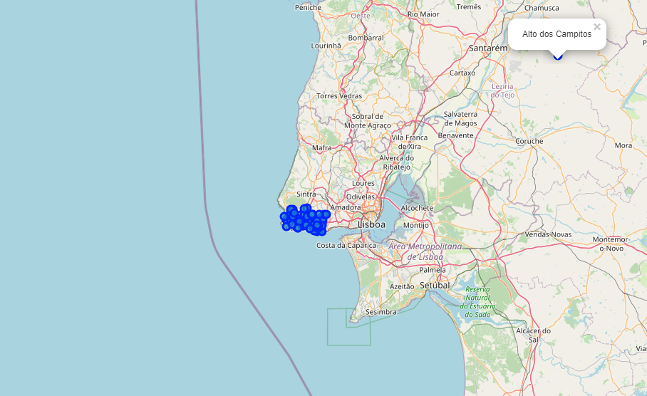
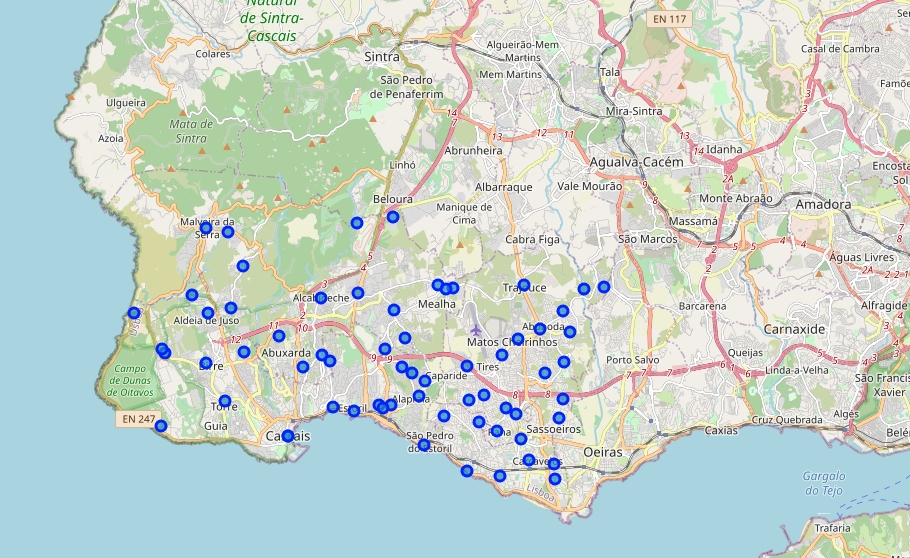
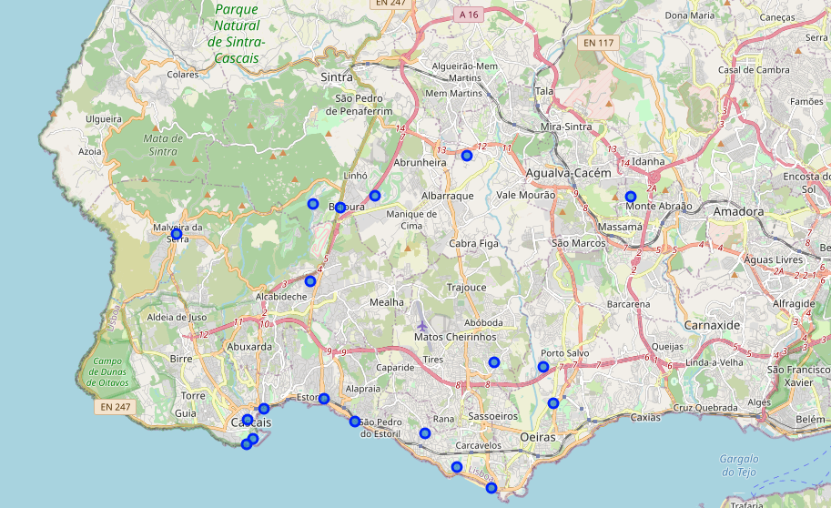
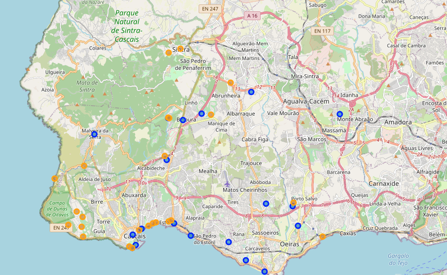
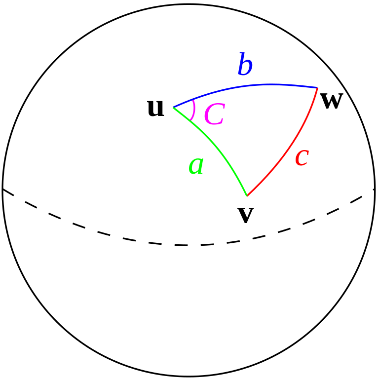
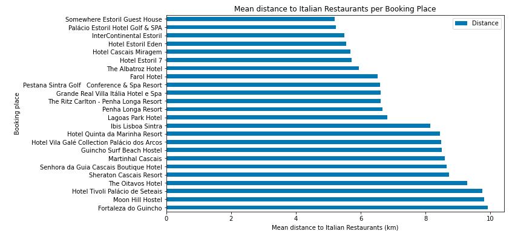
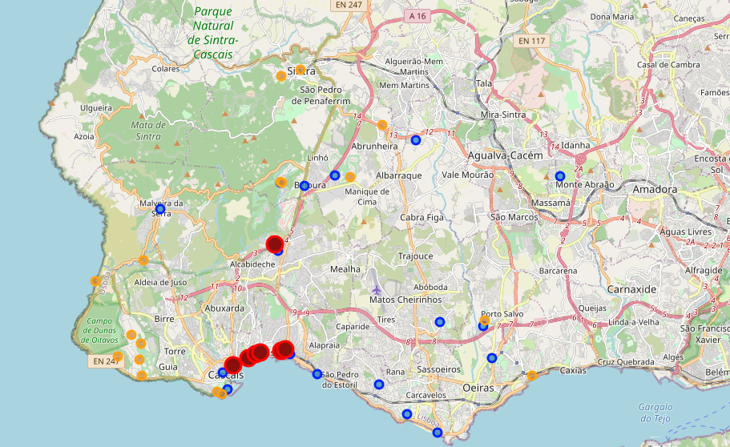

### **
Finding the most suitable Booking place in Cascais near Italian Restaurants
**
#### 
December 16, 2020

#### 
Hugo Cipriano

## 1. Introduction ##

#### 1.1 Background ####
Cascais is the finest resort town of the Lisbon coastline and is a popular holiday destination full of day and nighttime activites. 

#### 1.2 Problem ####
A couple from france is visiting Cascais and they really enjoy italian food, therefore they want to find the most suitable booking place to be near italian restaurants.

#### 1.3 Interest ####
This couple belongs to a climate activist group and they ride their own bycicles everywhere. Consequently, they want to find the booking place that, in theory, will require the least amount of travelling time to the italian restaurants.

## 2. Data acquisition and cleaning ##
#### 2.1 Data Sources ####
To access Cascais neighbourhoods, CTT - Correios de Portugal, the portuguese official post office, has an API with the detailed postcodes and regions, although it can't be easily accessed anymore. This [Github/cusco](https://github.com/cusco/ctt) shares a .csv dataset with all the regions and postal codes and will be used to scrap the regions of Cascais.

Italian restaurants and booking places can be accessed via [Foursquare API](https://developer.foursquare.com/developer/). 

#### 2.2 Data Cleaning ####
Regions in Portugal can drilled down from Distrito -> Concelho -> Freguesia -> Localidade. In this example, Lisbon is the 'Distrito, and we are going to explore Cascais which is a 'Concelho'.
For the dataset with all the regions and postal codes, it was initially filtered by the 'Concelho' = Cascais region before uploading it to the notebook and can be found [here](https://github.com/myrahz/Coursera_Capstone/blob/main/ctt-lat-lng-cascais.csv).

This dataset has 26 features that would detail addresses but the purpose was to scrape the Cascais neighbourhoods and therefore we only used 1 feature which was LOCALIDADE. 

This resulted in 66 entries of LOCALIDADE. Aftewards, Geocoder was used to discover each *Localidade's* coordinates hence resulting in a dataframe with LOCALIDADE, Latitude and Longitude.

|   	|     LOCALIDADE 	|  Latitude 	| Longitude 	|   	|
|--:	|---------------:	|----------:	|----------:	|---	|
| 0 	|        Abóboda 	| 38.725560 	| -9.333790 	|   	|
| 1 	|       Alapraia 	| 38.707520 	| -9.375460 	|   	|
| 2 	|    Alcabideche 	| 38.733800 	| -9.408970 	|   	|
| 3 	|       Alcoitão 	| 38.734950 	| -9.396570 	|   	|
| 4 	| Aldeia de Juzo 	| 38.729770 	| -9.448020 	|   	|

With this information we were then able to explore the venues on each LOCALIDADE of Cascais.

|   	| Neighborhood 	| Neighborhood Latitude 	| Neighborhood Longitude 	|                     Venue 	| Venue Latitude 	| Venue Longitude 	|        Venue Category 	|
|--:	|-------------:	|----------------------:	|-----------------------:	|--------------------------:	|---------------:	|----------------:	|----------------------:	|
| 0 	|      Abóboda 	|              38.72556 	|               -9.33379 	|               Burger King 	|      38.724053 	|       -9.336372 	|  Fast Food Restaurant 	|
| 1 	|      Abóboda 	|              38.72556 	|               -9.33379 	|             Bugio Terrace 	|      38.712962 	|       -9.324767 	|                Lounge 	|
| 2 	|      Abóboda 	|              38.72556 	|               -9.33379 	|     Casa das Francesinhas 	|      38.724810 	|       -9.322853 	| Portuguese Restaurant 	|
| 3 	|      Abóboda 	|              38.72556 	|               -9.33379 	|        Lagoas Health Club 	|      38.714207 	|       -9.309109 	|  Gym / Fitness Center 	|
| 4 	|      Abóboda 	|              38.72556 	|               -9.33379 	| A Boa Petisqueira da Mina 	|      38.706679 	|       -9.323525 	| Portuguese Restaurant 	|

With this information we dropped the Neighborhood information and removed the Venue duplicates due to the overlapping radius of each *Localidade*, i.e. the same venue could be retrieved from multiple *Localidades* due to its explore radius.

Thereupon the venues were filtered by Venue Category.

To acquire the restaurants Italian Restaurant or Pizza Place Venue Categories were filtered.

To acquire the booking places Hotels, Resorts and Hostels were filtered.

## 3. Exploratory Data Analysis ##

#### 3.1 Neighbourhoods distribution ####

After retrieving each of *Localidade's* coordinates, I was able to draw them on a map using Folium.

By doing this we were able to discover that one *Localidade*'s coordinates wasn't correct and we managed to fix it.

#### 3.2 Italian Restaurants distribution ####

After retrieving each of Restaurant coordinates, I was able to draw them on a map using Folium.

#### 3.3 Booking Places distribution ####

After retrieving each of Booking places coordinates, I was able to draw them on a map using Folium.
I used the previous map and added the Booking Places in Orange

## 4. Modeling ##

Now that I have both Restaurants and Booking Places coordinates, I can discover the most suited Booking Place, in terms of distance, to the Restaurants.

#### 4.1 Haversine Formula ####
Haversine formula determines the great-circle distance between two points on a sphere given their longitudes and latitudes which will suit us perfectly to discover the distance between each Booking Place and Restaurant.

This can be calculated using the [mpu library](https://mpu.readthedocs.io/en/latest/) and its function [haversine_distance](https://mpu.readthedocs.io/en/latest/mpu.html?highlight=haversine_distance#mpu.haversine_distance) and will result in a distance in kilometers

We can iterate each Booking Place and Each restaurant to calculate the distance between each pairing.

After doing so we achieve this result:

|   	|           Booking 	| Booking Type 	| Booking Latitude 	| Booking Longitude 	|                     Restaurant 	| Distance 	|   	|
|--:	|------------------:	|-------------:	|-----------------:	|------------------:	|-------------------------------:	|---------:	|---	|
| 0 	| Lagoas Park Hotel 	|        Hotel 	|        38.714855 	|          -9.30945 	|              Trecento Sessanta 	| 4.521263 	|   	|
| 1 	| Lagoas Park Hotel 	|        Hotel 	|        38.714855 	|          -9.30945 	|              Choupana Gordinni 	| 6.538750 	|   	|
| 2 	| Lagoas Park Hotel 	|        Hotel 	|        38.714855 	|          -9.30945 	| Lamassa - Fresh Handmade Pasta 	| 7.362378 	|   	|
| 3 	| Lagoas Park Hotel 	|        Hotel 	|        38.714855 	|          -9.30945 	|                   Il Siciliano 	| 9.923055 	|   	|
| 4 	| Lagoas Park Hotel 	|        Hotel 	|        38.714855 	|          -9.30945 	|                    Capricciosa 	| 9.332142 	|   	|

From now on we can calculate the mean distance per Booking Place by using the groupby function in pandas, resulting in:

|                                      Booking 	| Booking Type 	| Booking Latitude 	| Booking Longitude 	| Mean Distance 	|
|---------------------------------------------:	|-------------:	|-----------------:	|------------------:	|--------------:	|
|                Somewhere Estoril Guest House 	|        Hotel 	|        38.705316 	|         -9.394970 	|      5.195130 	|
|             Palácio Estoril Hotel Golf & SPA 	|        Hotel 	|        38.704751 	|         -9.396607 	|      5.238662 	|
|                     InterContinental Estoril 	|        Hotel 	|        38.704330 	|         -9.405819 	|      5.486354 	|
|                           Hotel Estoril Eden 	|        Hotel 	|        38.703827 	|         -9.407817 	|      5.553244 	|
|                        Hotel Cascais Miragem 	|        Hotel 	|        38.702467 	|         -9.410972 	|      5.672590 	|
|                              Hotel Estoril 7 	|        Hotel 	|        38.740338 	|         -9.399394 	|      5.716189 	|
|                           The Albatroz Hotel 	|        Hotel 	|        38.699910 	|         -9.417177 	|      5.945307 	|
|                                  Farol Hotel 	|        Hotel 	|        38.690436 	|         -9.422119 	|      6.520741 	|
|  Pestana Sintra Golf Conference & Spa Resort 	|        Hotel 	|        38.762963 	|         -9.367316 	|      6.594420 	|
|         Grande Real Villa Itália Hotel e Spa 	|       Resort 	|        38.691037 	|         -9.424179 	|      6.609578 	|
|        The Ritz Carlton - Penha Longa Resort 	|        Hotel 	|        38.761060 	|         -9.396330 	|      6.623328 	|
|                           Penha Longa Resort 	|        Hotel 	|        38.761407 	|         -9.397055 	|      6.664688 	|
|                            Lagoas Park Hotel 	|        Hotel 	|        38.714855 	|         -9.309450 	|      6.817594 	|
|                           Ibis Lisboa Sintra 	|        Hotel 	|        38.780450 	|         -9.353389 	|      8.138747 	|
|               Hotel Quinta da Marinha Resort 	|        Hotel 	|        38.707187 	|         -9.456728 	|      8.442110 	|
| Hotel Vila Galé Collection Palácio dos Arcos 	|        Hotel 	|        38.696575 	|         -9.289266 	|      8.490182 	|
|                    Guincho Surf Beach Hostel 	|       Hostel 	|        38.734984 	|         -9.455661 	|      8.492403 	|
|                            Martinhal Cascais 	|       Resort 	|        38.701860 	|         -9.457446 	|      8.586767 	|
|       Senhora da Guia Cascais Boutique Hotel 	|        Hotel 	|        38.696375 	|         -9.456344 	|      8.642473 	|
|                      Sheraton Cascais Resort 	|        Hotel 	|        38.710105 	|         -9.460854 	|      8.719376 	|
|                            The Oitavos Hotel 	|        Hotel 	|        38.702798 	|         -9.466774 	|      9.277334 	|
|              Hotel Tivoli Palácio de Seteais 	|        Hotel 	|        38.796708 	|         -9.396827 	|      9.753617 	|
|                             Moon Hill Hostel 	|       Hostel 	|        38.798649 	|         -9.388475 	|      9.812674 	|
|                         Fortaleza do Guincho 	|        Hotel 	|        38.728171 	|         -9.476295 	|      9.924178 	|

Afterwards I select the Booking Places with a mean distance of under 6 km and draw them on the map in a larger red circle.

## 5. Results ##

In this exercise I analyzed Booking Places and Italian Restaurants on the region of Cascais to find which Booking Place would be the most suitable, in terms of distance, to the Italian Restaurants. Even though this was a dummy example, the same idea can be used for different venue types, for instance, museums or other place of interests for tourists. Tourists could use this to find the most suitable place to be hosted in order to maximize their visit time based off their interests.

## 6. Future directions ##

I wanted to use a more complex model,for instance using ML, yet the problem didn't require it. Perhaps with more data on the venues, for instance the pricing and the rating, and a more restrictive problem, having only X amount of days to visit and different venue types, I could have introduced a ML model to discover what optimal venues to visit and where to be hosted within X amount of days.